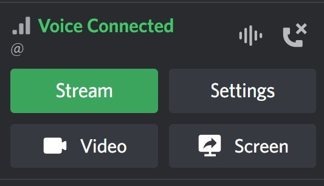

BetterDiscord plugin for screen share/remote control with unlimited resolution, bitrate, framerate

This plugin uses the latest release of my other project: https://github.com/nitedani/gstreamer-go-wrtc-remote

Clicking the Stream button will copy a unique URL to the clipboard. The URL opens the page where others can watch your stream. If remote control is enabled, the mouse/keyboard inputs are transferred to the streamer's computer. The connection between your computer and the viewer(s) is peer-to-peer by default. The peer-to-peer connections bandwidth usage adds up when multiple people watch your stream. Turning off peer-to-peer will route and distribute your stream through a hosted server. You can host your own distribution/signaling server, following the description of the project linked above. The server's url can be set in the plugin's config file.

